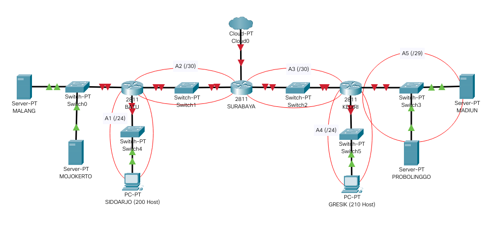
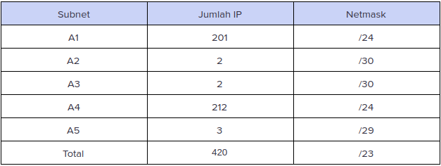
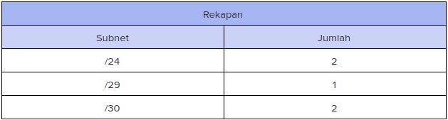
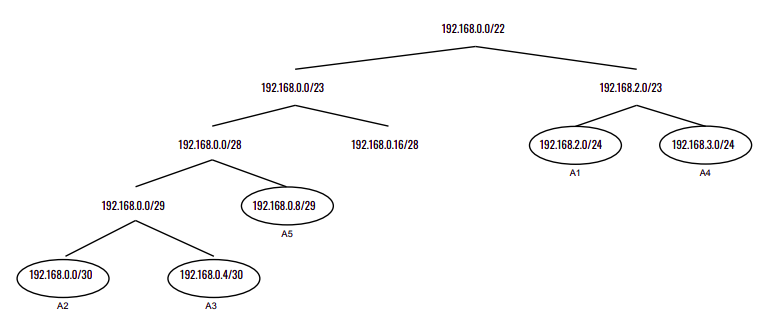
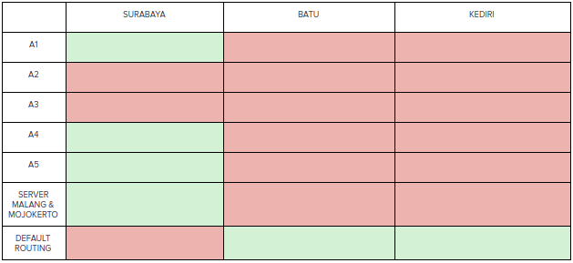

# Modul 5

 - VLSM
	 * <a href="#topologi-vlsm">Topologi</a>
	 * <a href="#netmask-vlsm">Pembagian Netmask</a>
	 * <a href="#pohon-vlsm">Pohon IP</a>
     * <a href="#routing-vlsm">Routing</a>
     * <a href="#pembagian-ip-vlsm">Pembagian IP</a>
 - DHCP
	 * <a href="#dhcp-server">DHCP Server</a>
	 * <a href="#dhcp-relay">DHCP Relay</a>
 - Firewall
	 * <a href="#soal-1">Soal 1</a>
     * <a href="#soal-2">Soal 2</a>
     * <a href="#soal-3">Soal 3</a>
     * <a href="#soal-4">Soal 4</a>
     * <a href="#soal-5">Soal 5</a>
     * <a href="#soal-6">Soal 6</a>
     * <a href="#soal-7">Soal 7</a>

## VLSM
<justify></justify>

Topologi pada UML beserta pembagian subnet : 

|                  | Pembagian IP      |                 |
|------------------|-------------------|-----------------|
| A1               | Network ID        | 192.168.2.0     |
|                  | Netmask           | 255.255.255.0   |
|                  | Broadcast Address | 192.168.2.255   |
| A2               | Network ID        | 192.168.0.0     |
|                  | Netmask           | 255.255.255.252 |
|                  | Broadcast Address | 192.168.0.3     |
| A3               | Network ID        | 192.168.0.4     |
|                  | Netmask           | 255.255.255.252 |
|                  | Broadcast Address | 192.168.0.7     |
| A4               | Network ID        | 192.168.3.0     |
|                  | Netmask           | 255.255.255.0   |
|                  | Broadcast Address | 192.168.3.255   |
| A5               | Network ID        | 192.168.0.8     |
|                  | Netmask           | 255.255.255.248 |
|                  | Broadcast Address | 192.168.0.15    |
| MALANG & MOJOKERTO | Network ID      | 10.151.79.32    |
|                  | Netmask           | 255.255.255.248 |
|                  | Broadcast Address | 10.151.79.39    |

</justify>

## DHCP
<justify></justify>

Konfigurasi <code>/etc/default/isc-dhcp-server</code> pada Mojokerto (DHCP Server) : 

    INTERFACES="eth0"

Konfigurasi <code>/etc/dhcp/dhcpd.conf</code> pada Mojokerto (DHCP Server) : 

    (topologi)
	subnet 10.151.79.32 netmask 255.255.255.248 {
	}

	(subnet A1 - Sidoarjo)
	subnet 192.168.2.0 netmask 255.255.255.0 {
	    range 192.168.2.2 192.168.2.254;
	    option routers 192.168.2.1;
	    option broadcast-address 192.168.2.255;
	    option domain-name-servers 10.151.79.34, 202.46.129.2;
	    default-lease-time 600;
	    max-lease-time 7200;
	}
	
	(subnet A4 - Gresik)
	subnet 192.168.3.0 netmask 255.255.255.0 {
	    range 192.168.3.2 192.168.3.254;
	    option routers 192.168.3.1;
	    option broadcast-address 192.168.3.255;
	    option domain-name-servers 10.151.79.34, 202.46.129.2;
	    default-lease-time 600;
	    max-lease-time 7200;
	}

Konfigurasi <code>/etc/default/isc-dhcp-relay</code> pada DHCP Relay (Batu dan Kediri): 

    - <code>SERVERS</code> : Menuju IP Server DHCP Server, yaitu IP Mojokerto  
    - <code>INTERFACES</code> : Menuju interface client dan server  

</justify>

## Firewall
<justify>

1. Konfigurasi iptables pada Surabaya agar topologi dapat mengakses keluar tetapi tidak menggunakan MASQUERADE:

    iptables -t nat -A POSTROUTING -o eth0 -j SNAT --to 10.151.78.18 –s 192.168.0.0/22

Keterangan :

- <code>-t nat</code> : menggunakan table nat

- <code>-A POSTROUTING</code> : karena perubahan dilakukan setelah proses routing

- <code>-o eth0</code> : karena paket keluar melewati interface eth0

- <code>-j SNAT</code> : untuk mengubah source ip address

- <code>--to 10.151.78.18</code> : source ip address siubah dengan ip eth0 Surabaya

- <code>–s 192.168.0.0/22</code> : NID yang akan diubah dengan SNAT

</justify>

<justify>

2. Konfigurasi iptables pada Surabaya untuk mendrop semua akses SSH dari luar Topologi (UML) pada DHCP dan DNS SERVER dan melakukan logging:

    iptables -N LOGGING
    iptables -A FORWARD -o eth1 -p tcp -d 10.151.79.32/29 --dport 22 -j LOGGING
    iptables -A LOGGING -m limit --limit 2/min -j LOG --log-prefix "IPTables-Dropped: " --log-level 4
    iptables -A LOGGING -j DROP

Keterangan :

- <code>-A FORWARD</code> : menggunakan chain FORWARD

- <code>-p tcp</code> : menggunakan protokol tcp (karena ssh)

- <code>-d 10.151.79.32/29</code> : NID tujuan (NID DHCP dan DNS SERVER)

- <code>--dport 22</code> : port ssh

- <code>--log-level 4</code> : log level warning

- <code>-j DROP</code> : untuk mendrop paket

</justify>

<justify>

3. Membatasi DHCP dan DNS server hanya boleh menerima maksimal 3 koneksi ICMP secara bersamaan yang berasal dari mana saja menggunakan ​iptables pada masing masing server​ , selebihnya akan di DROP dan melakukan logging:

    iptables -N LOGGING
    iptables -A INPUT -p icmp -m connlimit --connlimit-above 3 --connlimit-mask 0 -j LOGGING
    iptables -A LOGGING -m limit --limit 2/min -j LOG --log-prefix "IPTables-Dropped: " --log-level 4
    iptables -A LOGGING -j DROP

Keterangan :

- <code>-A INPUT</code> : menggunakan chain INPUT

- <code>-p icmp</code> : menggunakan protokol icmp

- <code>--connlimit-above 3</code> : membatasi 3 koneksi icmp

- <code>--connlimit-mask 0</code> : menandakan koneksi untuk semua sumber (berasal dari mana saja)

</justify>

<justify>

4. Membatasi akses ke MALANG yang berasal dari Subnet Sidoarjo pada pukul 07.00 - 17.00 pada hari Senin sampai Jumat selain itu paket akan di REJECT. Untuk iptables saya meletakannya pada router Batu.

    iptables -A FORWARD -i eth1 -o eth0 -s 192.168.2.0/24 -d 10.151.79.34 -m time --timestart 07:00 --timestop 17:00 --weekdays Mon,Tue,Wed,Thu,Fri -j ACCEPT
    iptables -A FORWARD -i eth1 -o eth0 -s 192.168.2.0/24 -d 10.151.79.34 -j REJECT

Keterangan :

- <code>--timestart</code> : menandakan waktu mulai

- <code>--timestop</code> : menandakan waktu selesai

- <code>--weekdays</code> : menentukan hari yang ingin di setting pada iptables

</justify>

<justify>

5. Membatasi akses ke MALANG yang berasal dari Subnet Gresik yang hanya diperbolehkan pada pukul 17.00 hingga pukul 07.00 setiap harinya selain itu paket akan di REJECT.Untuk iptables saya meletakannya pada router Batu.

    iptables -A FORWARD -i eth2 -o eth0 -d 10.151.79.34 -m time --timestart 07:01 --timestop 16:59 -j REJECT

</justify>

<justify>

6. Membatasi akses ke MALANG yang berasal dari Subnet Gresik yang hanya diperbolehkan pada pukul 17.00 hingga pukul 07.00 setiap harinya selain itu paket akan di REJECT.Untuk iptables saya meletakannya pada router Batu.

    iptables -t nat -A PREROUTING -p tcp -i eth0 -d 10.151.79.34 -m statistic --mode nth --every 2 --packet 0 -j DNAT --to-destination 192.168.0.10:80 
    iptables -t nat -A PREROUTING -p tcp -i eth0 -d 10.151.79.34 -j DNAT --to-destination 192.168.0.11:80

Keterangan :

- <code>-A PREROUTING</code> : karena perubahan dilakukan sebelum proses routing

- <code>--mode nth</code> : load balancing menggunakan algoritma round robin

- <code>--every 2</code> : setiap paket ke-2 yg ditangkap oleh iptables

- <code>--packet 0</code> : counter pertama pada setiap every

- <code>-j DNAT</code> : melakukan perubahan ip destination

</justify>

<justify>

7. Paket didrop oleh firewall (dalam topologi) tercatat dalam log pada setiap
UML yang memiliki aturan drop

    telah dicantumkan pada soal yang menggunakan iptables DROP

</justify>
